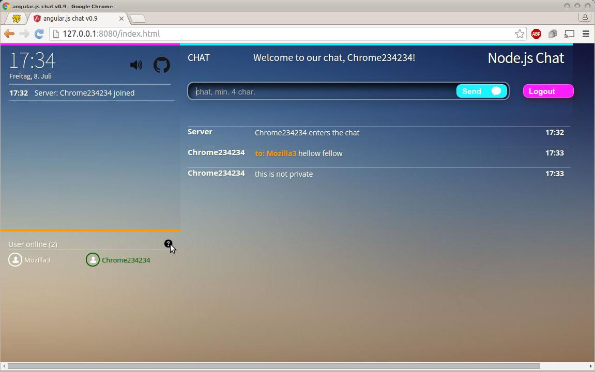

# Angular.js-Chat
chatapp with angular.js, node.js, express.io
Same as "Nodejs Chat" but build with Angular1 instead of jQuery. 

### General
this software is for experimental and tutorial use, not for professional or commercial use. Use it at your own risk! 

### Angular1 Assets
the main assets might be the services and the directives I designed here. See further information in my wiki. (I'm preparing the wiki)

### License
the MIT license

### Requirements
npm - node package manager

### Install
`npm install` 

### Running
after installing, run `node server.js` on console, then point your browser(s) on your machine(s) to 
http://127.0.0.1:8080/ and have fun! of course, you can change the port in *config.json*. to shutdown the server app, hit [CTRL] C

### Featuring
 - simple Login by Username (no pwd)
 - public and private messages
 - simple digital clock on top/left thanks to https://github.com/ticktoo/simpleClock

Server messages:
 - login/logoff user activity messages in the top left panel
 - Status messages for the user in the top panel 
 - Chat status message (READY,ERR,CHAT) left beside the status panel 

 - List of current online users in the lower left panel which are
 - marked green for user itself,
 - marked orange for a user in a current PM conversation with (private message)

### Frontend  
Non-responsive HTML5, CSS3 Frontend design inspired by 'PubNub Channel Presence' 
https://github.com/pubnub/pubnub-chat-channel-presence
 - supports newer browsers
 - no mobile devices

### Testing
monkey tested on Firefox 45, Opera 36, Chrome 48 on Ubuntu 12

### Development
I designed an environmet with Grunt: *jshint, uglify, cssmin*
LESS is not applied yet. It would make sense. For the case you want to fork, I suggest you apply it, but I cannot promise to accept PR ;) 
